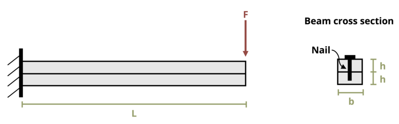

# Problem 10.17 - Shear Flow {.unnumbered}

## Problem Statement

A beam of length L = 10 ft is constructed by nailing together two boards with dimensions b = 3.5 in. and h = 1.5 in. The beam is subjected to a concentrated load F = 100 lb as shown. Each nail can withstand a shear load of 100 lb. What is the maximum permissible spacing between nails?

{fig-alt="A beam of length L is secured to the wall on the left end. A force F is applied at the right end. The beam has a cross section of height h and width b, with a nail at b/2 going through the beam."}

\[Problem adapted from © Kurt Gramoll CC BY NC-SA 4.0\]
