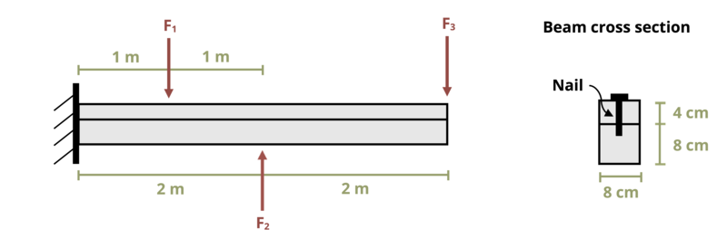

# Problem 10.18 - Shear Flow {.unnumbered}

## Problem Statement

A 4-m-long beam is constructed by nailing together two wooden boards as shown. The nails each have a diameter d = 5 mm and can withstand an average shear stress of 100 MPa. If loads F1 = 3 kN, F2 = 4 kN, and F3 = 2 kN, determine the maximum permissible spacing between the nails.

{fig-alt="A beam of legnth 2L is mounted to the wall on the left side. A force of F1 is applied a distance of L/2 from the wall, a force of F2 is applied a distance of L from the wall, and a force F3 is applied a distance of 2L from the wall. The beam has a rectangular cross section of height 12 cm and width 8 cm. A nail is in the center of the beam holding two pieces together."}

\[Problem adapted from © Kurt Gramoll CC BY NC-SA 4.0\]
