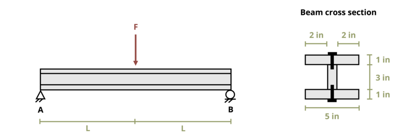

# Problem 10.19 - Shear Flow {.unnumbered}

## Problem Statement

A beam of length L = 8 ft is constructed by nailing together three wooden boards. The beam is subjected to a concentrated load F = 300 lb. If each nail can resist a shear load of 100 lb, determine the maximum permissible spacing between the nails.

{fig-alt="A beam of length 2L is subjected to a force F. The distance from A to F is length L and from F to B is length L. The beam has an I cross section of width 5 inches and height 5 inches. There are nails on the top and bottom of the I."}

\[Problem adapted from © Kurt Gramoll CC BY NC-SA 4.0\]
