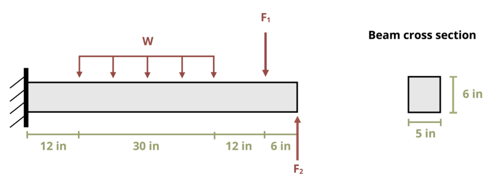

# Problem 10.8 - Shear Stress {.unnumbered}

## Problem Statement

A cantilever beam is loaded as shown, where w = 1 lb/in., F1 = 5 lb, and F2 = 10 lb. What is the maximum shear stress in the beam?

## Problem Image

{fig-alt="A beam is mounted to a wall on the left end and undergoes a distributed load w, an applied force F1, and an applied force F2. The applied force is applied from 12in to 42in from the left end of the beam. Force F1 is applied 54in from the wall and force F2 is applied 60in from the wall. The beam has a rectangular cross section of 6in high and 5in wide."}

\[Problem adapted from © Kurt Gramoll CC BY NC-SA 4.0\]
