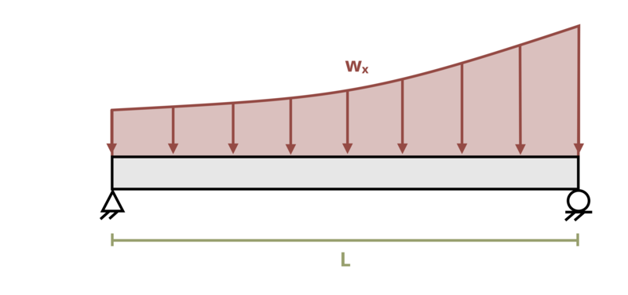

# Problem 11.16 - By Integration of Load Equation {.unnumbered}

{fig-alt="Picture with a beam subjected to a non uniform distributed force loading. The beam is of length L. The distributed force wx is applied over the entire length of the beam."}
\[Problem adapted from © Kurt Gramoll CC BY NC-SA 4.0\]
```{shinylive-python}
#| standalone: true
#| viewerHeight: 600
#| components: [viewer]

from shiny import App, render, ui, reactive
import random
import asyncio
import io
import math
import string
from datetime import datetime
from pathlib import Path

def generate_random_letters(length):
    # Generate a random string of letters of specified length
    return ''.join(random.choice(string.ascii_lowercase) for _ in range(length))  

problem_ID="398"
L=reactive.Value("__")
wx=reactive.Value("__")
EI=reactive.Value("__")
  
attempts=["Timestamp,Attempt,Answer,Feedback\n"]

app_ui = ui.page_fluid(
    ui.markdown("**Please enter your ID number from your instructor and click to generate your problem**"),
    ui.input_text("ID","", placeholder="Enter ID Number Here"),
    ui.input_action_button("generate_problem", "Generate Problem", class_="btn-primary"),
    ui.markdown("**Problem Statement**"),
    ui.output_ui("ui_problem_statement"),
    ui.input_text("answer","Your Answer in units of cm", placeholder="Please enter your answer"),
    ui.input_action_button("submit", "Submit Answer", class_="btn-primary"),
    ui.download_button("download", "Download File to Submit", class_="btn-success"),
)

def server(input, output, session):
    # Initialize a counter for attempts
    attempt_counter = reactive.Value(0)

    @output
    @render.ui
    def ui_problem_statement():
        return[ui.markdown(f"A beam of length L = {L()} m is loaded with a distributed load w(x) = {wx()}e<sup>x</sup> kN/m. Determine the deflection at the midpoint of the beam if EI = {EI()} kN-m<sup>2</sup>.")]
    
    @reactive.Effect
    @reactive.event(input.generate_problem)
    def randomize_vars():
        random.seed(input.ID()+100)
        L.set(random.randrange(10,100,1)/10)
        wx.set(random.randrange(11,40,1)/10)
        EI.set(L()+round(random.randrange(10,50,1)/10))
        
    @reactive.Effect
    @reactive.event(input.submit)
    def _():
        attempt_counter.set(attempt_counter() + 1)  # Increment the attempt counter on each submission.
        C2 = wx()
        C1 = wx()*math.e-wx()
        C4 = wx()
        C3 = wx()*math.e-C1/6-wx()/2-C4
        x = L()/2
        instr= (-wx()*math.e**x+C1/6*x**3+C2/2*x**2+C3*x+C4)/EI()*100
        if math.isclose(float(input.answer()), instr, rel_tol=0.01):
            check = "*Correct*"
            correct_indicator = "JL"
        else:
            check = "*Not Correct.*"
            correct_indicator = "JG"

        # Generate random parts for the encoded attempt.
        random_start = generate_random_letters(4)
        random_middle = generate_random_letters(4)
        random_end = generate_random_letters(4)
        encoded_attempt = f"{random_start}{problem_ID}-{random_middle}{attempt_counter()}{correct_indicator}-{random_end}{input.ID()}"

        # Store the most recent encoded attempt in a reactive value so it persists across submissions
        session.encoded_attempt = reactive.Value(encoded_attempt)

        # Append the attempt data to the attempts list without the encoded attempt
        attempts.append(f"{datetime.now()}, {attempt_counter()}, {input.answer()}, {check}\n")

        # Show feedback to the user.
        feedback = ui.markdown(f"Your answer of {input.answer()} is {check}.")
        m = ui.modal(
            feedback,
            title="Feedback",
            easy_close=True
        )
        ui.modal_show(m)

    @session.download(filename=lambda: f"Problem_Log-{problem_ID}-{input.ID()}.csv")
    async def download():
        # Start the CSV with the encoded attempt (without label)
        final_encoded = session.encoded_attempt() if session.encoded_attempt is not None else "No attempts"
        yield f"{final_encoded}\n\n"
        
        # Write the header for the remaining CSV data once
        yield "Timestamp,Attempt,Answer,Feedback\n"
        
        # Write the attempts data, ensure that the header from the attempts list is not written again
        for attempt in attempts[1:]:  # Skip the first element which is the header
            await asyncio.sleep(0.25)  # This delay may not be necessary; adjust as needed
            yield attempt

# App installation
app = App(app_ui, server)
```
