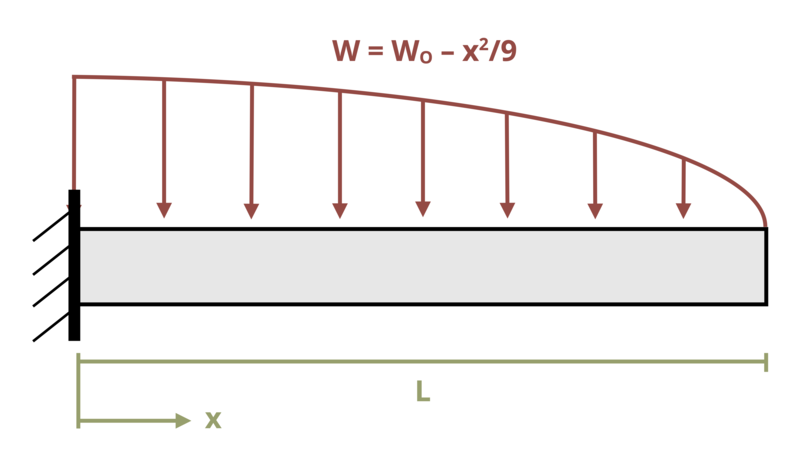

# Problem 11.19 - By Integration of Load Equation {.unnumbered}

## Problem Statement

A beam of length L = 15 ft is subjected to a distributed load as shown where w0 = 25 kip/ft. Determine the magnitude of the deflection at x = 0.5L. Assume EI = 45,000 kip-ft2.

{fig-alt="A cantilever beam of length L is subjected to a distributed load w defined as w = w0-x^2/9."}

\[Problem adapted from © Kurt Gramoll CC BY NC-SA 4.0\]
