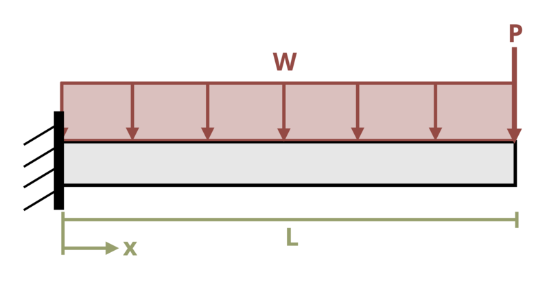

# Problem 11.1 - By Integration of Moment Equation {.unnumbered}

## Problem Statement

A cantilever beam of length L = 7.5 m is subjected to a distributed load w = 6.5 kN/m and concentrated load P = 15 kN. Determine the maximum deflection of the beam. Assume EI = 25,000 kN-m2.

{fig-alt="A cantilever beam of length L is subjected to a distributed load w and a point load P."}

\[Problem adapted from © Kurt Gramoll CC BY NC-SA 4.0\]
