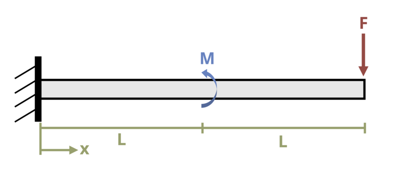

# Problem 11.22 - By Superposition {.unnumbered}

## Problem Statement

A cantilever beam is loaded as shown where L = 10 m, M = 50 kN-m, and F = 50 kN. Determine the magnitude of the deflection at the free end of the beam. Assume EI = 45000 kN-m2.

{fig-alt="A cantilever beam of length 2L has a force P and a moment M applied to it. The moment is applied at length L and the force P is applied at length 2L."}
\[Problem adapted from © Kurt Gramoll CC BY NC-SA 4.0\]
