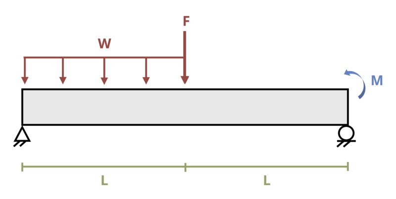

# Problem 11.23 - By Superposition {.unnumbered}

## Problem Statement

A simply supported beam is loaded as shown where L = 5 m, M = 2 kN-m, w = 1.5 kN/m, and F = 1 kN. Determine the magnitude of the deflection at the center of the beam. Assume EI = 30000 kN-m2.

{fig-alt="A simply supported beam of length 2L is subjected to a distributed load w, a force F, and moment M. The distributed load occurs over length L, the force occurs at L, and the moment occurs at 2L."}
\[Problem adapted from © Kurt Gramoll CC BY NC-SA 4.0\]
