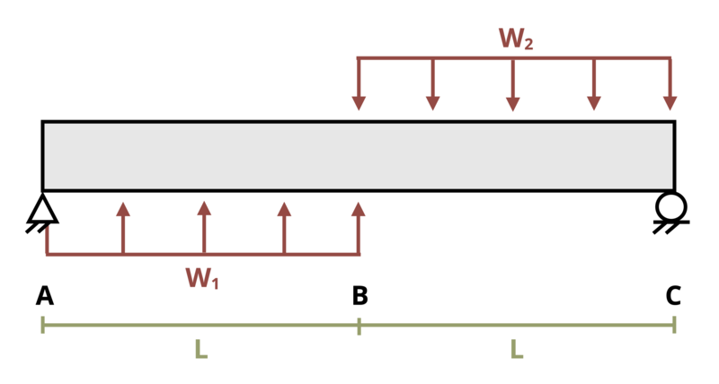

# Problem 11.24 - By Superposition {.unnumbered}

## Problem Statement

A simply supported beam is loaded as shown where L = 2 m, w1 = 2 kN/m, and w2 = 3 kN/m. Determine the magnitude of the deflection at the center of the beam. Assume EI = 30,000 kN-m2.

{fig-alt="A simply supported beam of length 2L is subjected to two distributed loads, w1 and w2. The distributed load w1 occurs over length L and the second distributed load w2 occurs from L to 2L."}
\[Problem adapted from © Kurt Gramoll CC BY NC-SA 4.0\]
