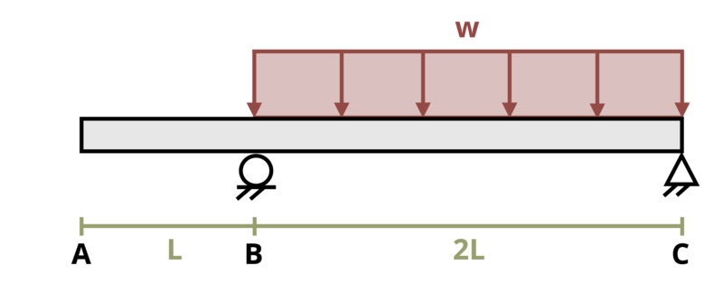

# Problem 11.25 - By Superposition {.unnumbered}

## Problem Statement

An overhanging beam is loaded as shown where L = 7.5 m and w = 7.5 kN/m. Determine the magnitude of the deflection at point A. Assume EI = 30,000 kN-m2.

{fig-alt="An overhanging beam of length 3L has a distributed load w applied to it. The beam overhangs length L, and the distributed load is applied from L to 3L."}
\[Problem adapted from © Kurt Gramoll CC BY NC-SA 4.0\]
