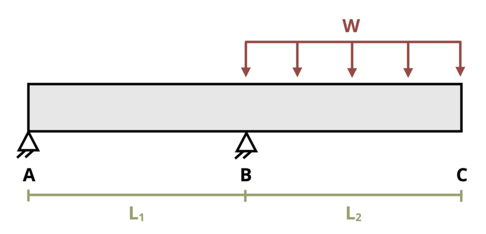

# Problem 11.26 - By Superposition {.unnumbered}

## Problem Statement

An overhanging beam is loaded as shown where L1 = 7 ft, L2 = 5 ft, and w = 200 kip/ft. Determine the deflection at the point C. Assume EI = 29,000 kip-ft2.

{fig-alt="An overhanging beam of length L1+L2 is subjected to a distributed load w. The distributed load is applied over length L2."}
\[Problem adapted from © Kurt Gramoll CC BY NC-SA 4.0\]
