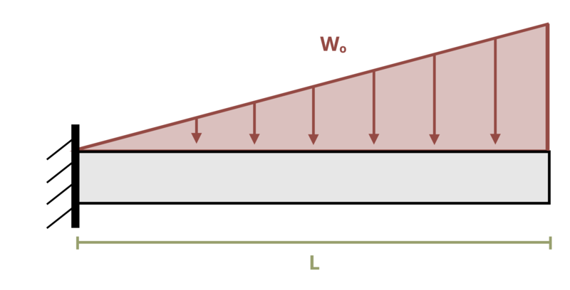

# Problem 11.2 - By Integration of Moment Equation {.unnumbered}

## Problem Statement

A cantilever beam of length L = 1.5 m is subjected to a linear distributed load where w0 = 1 kN/m. Determine the magnitude of the slope of the beam at the free end. Assume EI = 10 kN-m2.

{fig-alt="A cantilever beam of length L is subjected to a linear distributed load w0."}

\[Problem adapted from © Kurt Gramoll CC BY NC-SA 4.0\]
