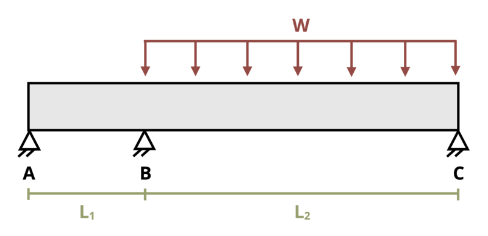

# Problem 11.36 - Statically Indeterminate Problems {.unnumbered}

## Problem Statement

A beam of length L1 = 3 ft and L2 = 6 ft is subjected to a distributed load w = 250 kip/ft as shown. Determine the reaction force at support B. Assume EI = 20,000 kip-ft2.

{fig-alt="A simply supported beam of length L1+L2 is subjected to a distributed load w. The distributed load occurs over L2."}
\[Problem adapted from © Kurt Gramoll CC BY NC-SA 4.0\]
