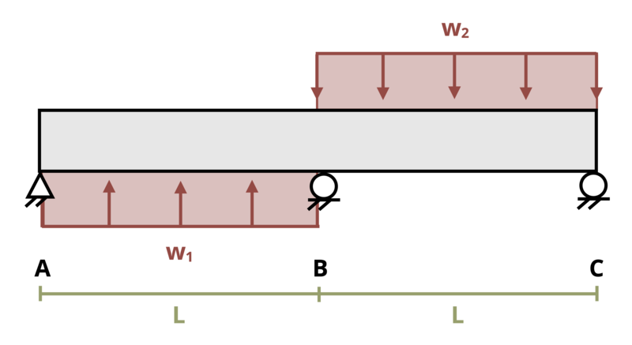

# Problem 11.37 - Statically Indeterminate Problems {.unnumbered}

## Problem Statement

A beam is subjected to two distributed loads, w1 = 2 kN/m and w2 = 3 kN/m as shown. It is supported by a pin at A and rollers at B and C. If length L = 2 m, determine the reaction force at support B. Assume EI = 30,000 kN-m2.

{fig-alt="A simply supported beam of length 2L is subjected to two distributed loads w1 and w2. The distributed load w1 occurs over L and the distributed load w2 occurs over L."}
\[Problem adapted from © Kurt Gramoll CC BY NC-SA 4.0\]
