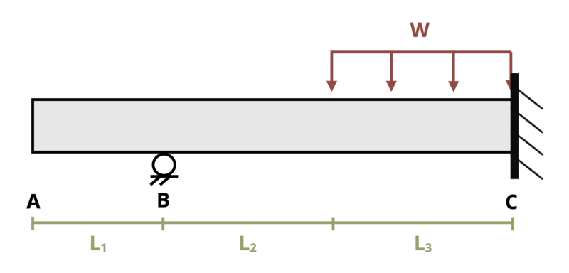

# Problem 11.38 - Statically Indeterminate Problems {.unnumbered}

## Problem Statement

A propped cantilever beam is subjected to a distributed load w = 2 kip/ft as shown. If length L1 = 2 ft, L2 = 3 ft, and L3 = 3 ft, determine the magnitude of the moment reaction at the wall. Assume EI = 20,000 kip-ft2.

{fig-alt="A beam of length L1+L2+L3 is subjected to a distributed load w and is connected to the wall at point C. The distance from A to B is L1, the distance from B to the start of w is L2, and the distance from the start of w to the wall at C is L3. There is a pin at point B."}
\[Problem adapted from © Kurt Gramoll CC BY NC-SA 4.0\]
