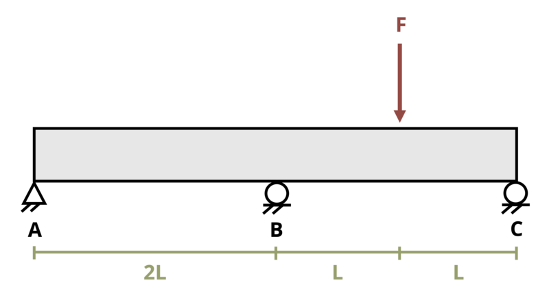

# Problem 11.39 - Statically Indeterminate Problems {.unnumbered}

## Problem Statement

A beam is subjected to force F = 155 kN as shown. If length L = 4 m, determine the reaction force at support B. Assume EI = 30,000 kN-m2.

{fig-alt="A beam of length 4L is subjected to a point load F. The distance from A to B is 2L, the distance from B to the point load is L, and the distance from the point load to C is L. A, B, and C are all pins."}
\[Problem adapted from © Kurt Gramoll CC BY NC-SA 4.0\]
