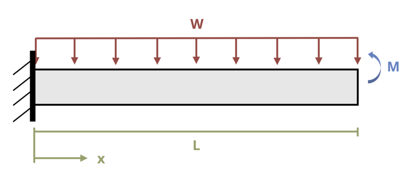

# Problem 11.3 - By Integration of Moment Equation {.unnumbered}

## Problem Statement

A cantilever beam of length L = 4 m is subjected to a distributed load w = 2 kN/m and couple M = 5 kN-m. Determine the deflection of the beam at the free end. Assume EI = 25,000 kN-m2.

{fig-alt="A cantilever beam of length L is subjected to a distributed load w and a coupled moment M at the free end."}

\[Problem adapted from © Kurt Gramoll CC BY NC-SA 4.0\]
