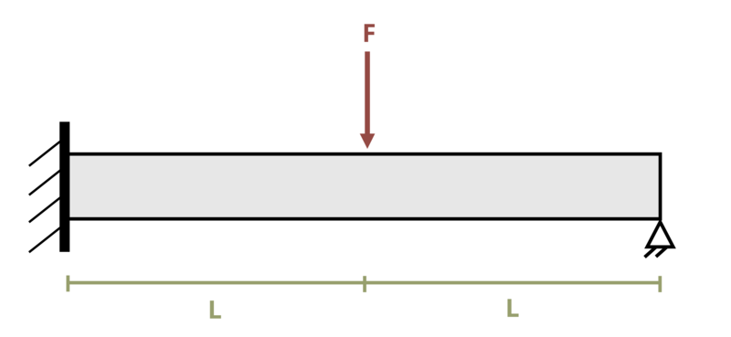

# Problem 11.40 - Statically Indeterminate Problems {.unnumbered}

## Problem Statement

A beam is subjected to force F = 10 kN as shown. If length L = 2 m, determine the reaction force at support B. Assume EI = 12,500 kN-m2.

{fig-alt="A beam of length 2L is subjected to a force F. The beam is mounted on the left end to a wall, and the force F is applied a distance of L away. The right end of the beam is pinned."}
\[Problem adapted from © Kurt Gramoll CC BY NC-SA 4.0\]
