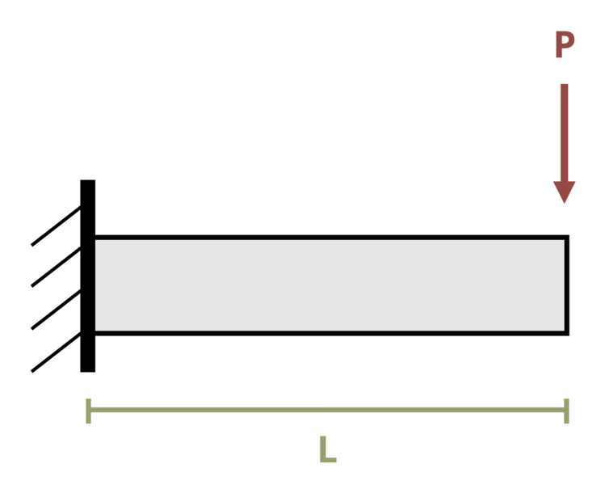

# Problem 11.53 - Intermediate Beam Design {.unnumbered}

## Problem Statement

A pipe with an outer diameter of 100 mm is to be used as a cantilever beam of length L = 2.5 m carrying a load P = 6.8 kN at the free end. Determine the minimum required pipe wall thickness if the allowable bending stress, σallow = 400 MPa, the allowable shear stress, τallow = 240 MPa, and the allowable deflection = 50 mm. Assume E = 200 GPa.

{fig-alt="A pipe of length L has a force P applied at the free end."}
\[Problem adapted from © Chris Galitz CC BY NC-SA 4.0\]
