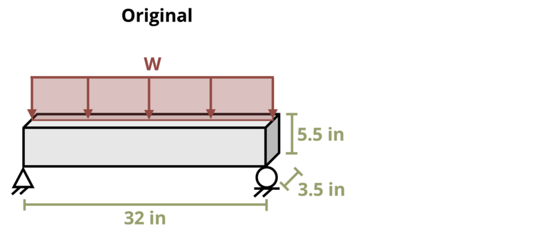

# Problem 11.54 - Intermedate Beam Design {.unnumbered}

{fig-alt="Picture with the original and proposed beam designs for a window opening. The original beam design has a length of L1, a width of 3.5 in and a height of 5.5 in. The proposed beam design has a length of L2, a width of 5.25 in and a height of h."}
\[Problem adapted from © Chris Galitz CC BY NC-SA 4.0\]
```{shinylive-python}
#| standalone: true
#| viewerHeight: 600
#| components: [viewer]

from shiny import App, render, ui, reactive
import random
import asyncio
import io
import math
import string
from datetime import datetime
from pathlib import Path

def generate_random_letters(length):
    # Generate a random string of letters of specified length
    return ''.join(random.choice(string.ascii_lowercase) for _ in range(length))  

problem_ID="685"
L1=reactive.Value("__")
L2=reactive.Value("__")
  
attempts=["Timestamp,Attempt,Answer,Feedback\n"]

app_ui = ui.page_fluid(
    #ui.markdown("**Please enter your ID number from your instructor and click to generate your problem**"),
    #ui.input_text("ID","", placeholder="Enter ID Number Here"),
    #ui.input_action_button("generate_problem", "Generate Problem", class_="btn-primary"),
    ui.markdown("**Problem Statement**"),
    ui.output_ui("ui_problem_statement"),
    ui.input_text("answer","Your Answer in units of in", placeholder="Please enter your answer"),
    ui.input_action_button("submit", "Submit Answer", class_="btn-primary"),
    #ui.download_button("download", "Download File to Submit", class_="btn-success"),
)

def server(input, output, session):
    # Initialize a counter for attempts
    attempt_counter = reactive.Value(0)

    @output
    @render.ui
    def ui_problem_statement():
        randomize_vars()
        return[ui.markdown(f"A DIY enthusiast is widening a window opening in a load-bearing wall. The existing beam above the window measures 3.5 in. thick by 5.5 in. tall, and has length L<sub>1</sub> = {L1()} in. A new beam made form the same wood is 5.25 in. thick. Determine the required height, h, if this beam will span a length L<sub>2</sub> = {L2()} in. and the bending stress, shear stress, and deflection do not exceed the values of the original beam.")]
    
    #@reactive.Effect
    #@reactive.event(input.generate_problem)
    def randomize_vars():
        random.seed(101)
        L1.set(random.randrange(20,40,1))
        L2.set(L1()+random.randrange(15,25,1))
        
    @reactive.Effect
    @reactive.event(input.submit)
    def _():
        attempt_counter.set(attempt_counter() + 1)  # Increment the attempt counter on each submission.
        Io=3.5*5.5**3/12
        sigma_o=L1()**2*55/2/(8*Io)
        sigma_p=L2()**2/2/(8/12*5.25)
        bendmin=math.sqrt(sigma_p/sigma_o)
        tau_o=3*L1()/2/(2*3.5*5.5)
        tau_p=3*L2()/2/(2*5.25)
        shearmin=tau_p/tau_o
        delta_o=5*L1()**4/(384*Io)
        delta_p=5*L2()**4/(384*5.25/12)
        deflectionmin=(delta_p/delta_o)**(1/3)
        instr= max(bendmin,shearmin,deflectionmin)
        if math.isclose(float(input.answer()), instr, rel_tol=0.01):
            check = "*Correct*"
            correct_indicator = "JL"
        else:
            check = "*Not Correct.*"
            correct_indicator = "JG"

        # Generate random parts for the encoded attempt.
        random_start = generate_random_letters(4)
        random_middle = generate_random_letters(4)
        random_end = generate_random_letters(4)
        #encoded_attempt = f"{random_start}{problem_ID}-{random_middle}{attempt_counter()}{correct_indicator}-{random_end}{input.ID()}"

        # Store the most recent encoded attempt in a reactive value so it persists across submissions
        #session.encoded_attempt = reactive.Value(encoded_attempt)

        # Append the attempt data to the attempts list without the encoded attempt
        attempts.append(f"{datetime.now()}, {attempt_counter()}, {input.answer()}, {check}\n")

        # Show feedback to the user.
        feedback = ui.markdown(f"Your answer of {input.answer()} is {check}.")
        m = ui.modal(
            feedback,
            title="Feedback",
            easy_close=True
        )
        ui.modal_show(m)

    #@render.download(filename=lambda: f"Problem_Log-{problem_ID}-{input.ID()}.csv")
    async def download():
        # Start the CSV with the encoded attempt (without label)
        final_encoded = session.encoded_attempt() if session.encoded_attempt is not None else "No attempts"
        yield f"{final_encoded}\n\n"
        
        # Write the header for the remaining CSV data once
        yield "Timestamp,Attempt,Answer,Feedback\n"
        
        # Write the attempts data, ensure that the header from the attempts list is not written again
        for attempt in attempts[1:]:  # Skip the first element which is the header
            await asyncio.sleep(0.25)  # This delay may not be necessary; adjust as needed
            yield attempt

# App installation
app = App(app_ui, server)
```
