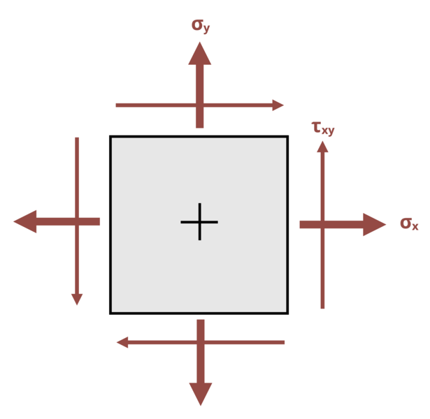

# Problem 12.12 - Principal Stresses {.unnumbered}

## Problem Statement

The state of stress at a point in a beam is shown, where σx = 3 MPa, σy = 5 MPa, and τxy = 3 MPa. Determine the maximum principal stress σ1 for this state of stress, and the angle at which this stress occurs, measured counterclockwise from the x-axis.

{fig-alt="A member is subjected to a state of stress caused by sigma_x, sigma_y, and tau_xy."}
\[Problem adapted from © Kurt Gramoll CC BY NC-SA 4.0\]
