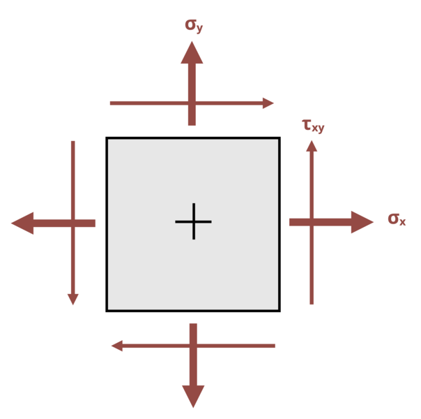

# Problem 12.13 - Principal Stresses {.unnumbered}

## Problem Statement

The state of stress at a point in a beam is shown, where σx = 25 ksi, σy = 15 ksi, and τxy is unknown. The maximum shear stress for this state of stress is τmax = 30 ksi. Determine the angle that this maximum stress occurs at.

{fig-alt=A member is subjected to a state of stress caused by sigma_x, and sigma_y."}
\[Problem adapted from © Kurt Gramoll CC BY NC-SA 4.0\]
