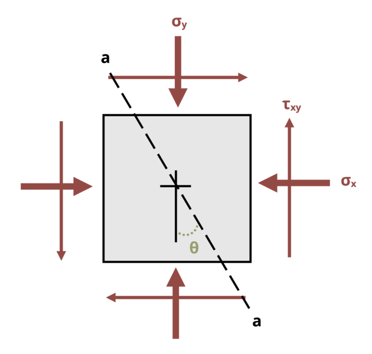

# Problem 12.1 - Equations {.unnumbered}

## Problem Statement

A point in a beam is subjected to the state of stress shown, where σx = 20 ksi, σy = 35 ksi, and τxy = 15 ksi. Determine the normal stress acting on plane a-a if angle Θ = 25°.

{fig-alt="A member is induced to a state of stress with components sigma_y, tau_xy_ and sigma_x. The ember has a plane a-a at an angle theta."}
\[Problem adapted from © Kurt Gramoll CC BY NC-SA 4.0\]
