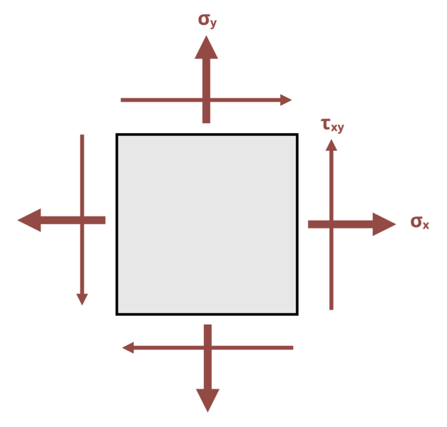

# Problem 12.26 - Mohr's Circle {.unnumbered}

## Problem Statement

The state of stress at a point in a beam is shown, where σx = 20 MPa, σy = 10 MPa, and τxy = 10 MPa. Construct Mohr's Circle for the given state of stress. Then determine the maximum principal stress σ1 for this state of stress, and the angle at which this stress occurs, measured counterclockwise from the x-axis.

{fig-alt="A member is subjected to a state of stress caused by sigma_x, sigma_y, and tau_xy."}
\[Problem adapted from © Kurt Gramoll CC BY NC-SA 4.0\]
