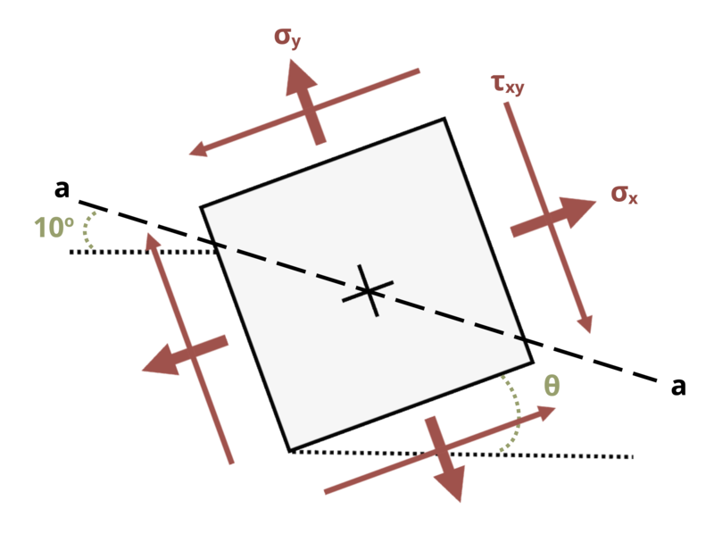

# Problem 12.2 - Equations {.unnumbered}

## Problem Statement

A point in a beam is subjected to the state of stress shown, where σx = 12 MPa, σy = 24 MPa, and τxy = 6 MPa. Determine the normal stress acting on plane a-a if angle Θ = 25°.

{fig-alt="A member under a state of stress is rotated at an angle of theta along the plane a-a. The member undergoes stresses sigma_y, sigma_x, and tau_xy."}
\[Problem adapted from © Kurt Gramoll CC BY NC-SA 4.0\]
