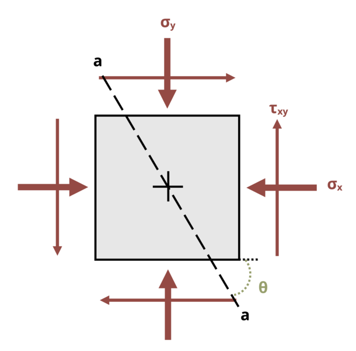

# Problem 12.3 - Equations {.unnumbered}

## Problem Statement

A point in a beam is subjected to the state of stress shown, where σx = 5.0 MPa, σy = 12.5 MPa, and τxy = 3.5 MPa. Determine the magnitude of the normal stress and the magnitude of the shear stress acting on plane a-a if angle Θ = 67°.

{fig-alt="A state of stress on a member is defined by sigma_x, sigma_y and tau_xy. The plane a-a is at an angle of theta."}
\[Problem adapted from © Kurt Gramoll CC BY NC-SA 4.0\]
