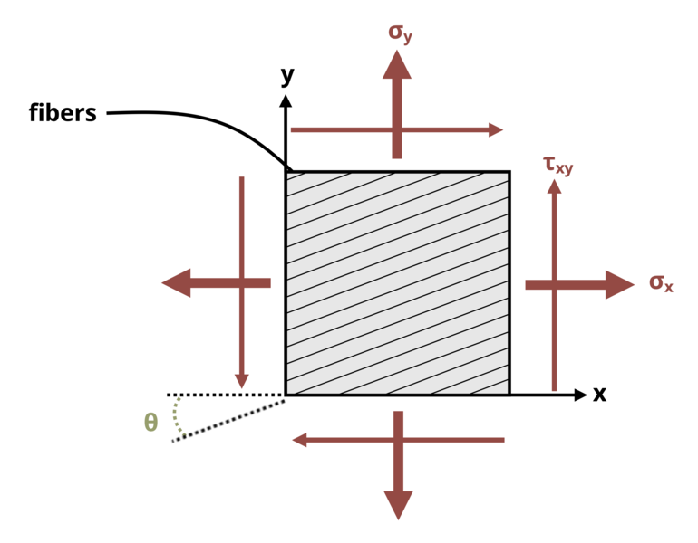

# Problem 12.4 - Equations {.unnumbered}

## Problem Statement

A material made from fibers is stressed as shown in the diagram. Stresses σx = 20 ksi, σy = 10 ksi, and τxy = 10 ksi. Determine the magnitude of the normal stress acting perpendicular to the fibers and the magnitude of the shear stress acting parallel to the fibers if angle Θ = 20°.

{fig-alt="A material made from fibers is subjected to the stresses sigma_y, sigma_x, and tau_xy. The fibers are at an angle theta. "}
\[Problem adapted from © Kurt Gramoll CC BY NC-SA 4.0\]
