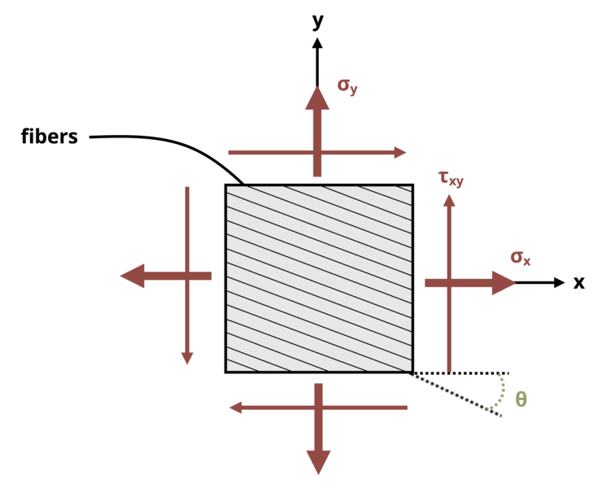

# Problem 12.5 - Equations {.unnumbered}

## Problem Statement

A material made from fibers is stressed as shown in the diagram. Stresses σx = 45 ksi, σy = 5 ksi, and τxy = 10 ksi. Determine the magnitude of the normal stress acting perpendicular to the fibers and the magnitude of the shear stress acting parallel to the fibers if angle Θ = 18°.

{fig-alt="A material made from fibers is stressed by sigma_x, sigma_y, and tau_xy. The fibers run at an angle of theta."}
\[Problem adapted from © Kurt Gramoll CC BY NC-SA 4.0\]
