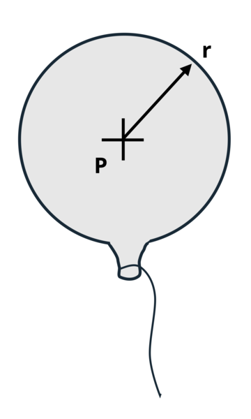

# Problem 13.15 - Spherical {.unnumbered}

## Problem Statement

A balloon with a wall thickness of 0.02 in. is inflated to a pressure of 30 psi. If the balloon material fails in tension at 8,000 psi, what is the maximum radius of the balloon using a factor of safety of 2?

{fig-alt="A balloon with a radius of r is inflated to a pressure of P."}
\[Problem adapted from © Kurt Gramoll CC BY NC-SA 4.0\]
