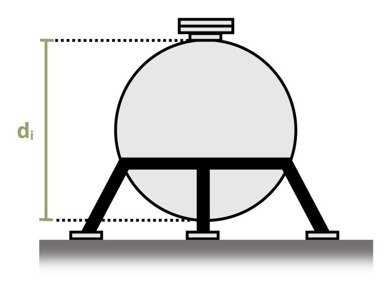

# Problem 13.16 - Spherical {.unnumbered}

## Problem Statement

A spherical thin-walled pressure vessel is to be constructed of steel with a yield stress of 50 ksi and a wall thickness t = 1/4 in. If the internal diameter of the tank is di = 20 ft, determine the maximum allowable pressure before yielding.

{fig-alt="A spherical pressure vessel has a internal diameter of di and a thickness of t."}
\[Problem adapted from © Kurt Gramoll CC BY NC-SA 4.0\]
