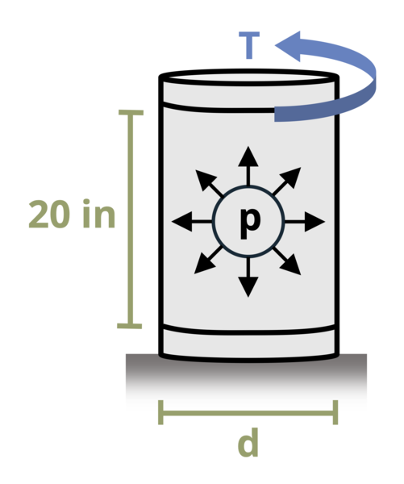

# Problem 13.1 - Cylindrical {.unnumbered}

## Problem Statement

A thin-walled cylindrical pressure vessel with an outside diameter d = 18 in. is subjected to an internal pressure P = 100 psi and an external torque T = 180 kip-in. at its top. The base is fixed to the ground. If the vessel wall thickness is t = 0.25 in., determine the absolute largest principal stress in the vessel wall.

{fig-alt="A cylindrical pressure vessel has a thickness of t and an outer diameter of d. There is an internal pressure P and an external torque of T at the top."}
\[Problem adapted from © Kurt Gramoll CC BY NC-SA 4.0\]
