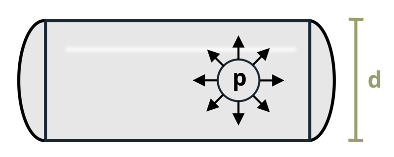

# Problem 13.2 - Cylindrical {.unnumbered}

## Problem Statement

A cylindrical pressure vessel of outer diameter d = 750 mm experiences an internal pressure P = 20 kPa. Determine the maximum in-plane shear stress in the vessel wall if the wall thickness is t = 10 mm.

{fig-alt="A pressure vessel with a diameter of d has an internal pressure P and a thickness of t."}
\[Problem adapted from © Kurt Gramoll CC BY NC-SA 4.0\]
