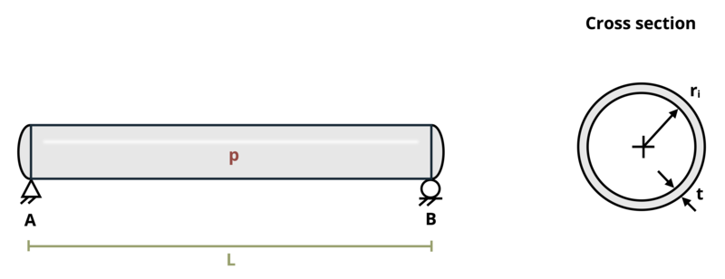

# Problem 13.3 - Cylindrical {.unnumbered}

## Problem Statement

A gas storage tank with an internal radius ri = 18 in. and wall thickness t = 3/8 in. is filled to an internal pressure P = 2,000 psi. If the original length L = 18 ft., determine the total axial deflection (change in length) of the tank after filling. Assume E = 29,000 ksi and ν = 0.3.

{fig-alt="A circular tank has an internal pressure of P, an inner radius of ri, a thickness of t, and a length of L."}
\[Problem adapted from © Kurt Gramoll CC BY NC-SA 4.0\]
