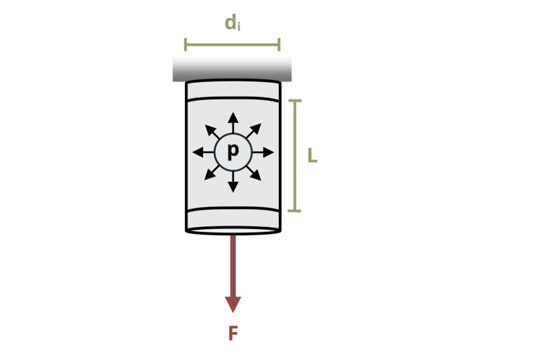

# Problem 13.4 - Cylindrical {.unnumbered}

## Problem Statement

A cylindrical thin-walled pressure vessel with an inner diameter di = 240 mm is subjected to an unknown internal pressure, P. A vertical load F = 1 kN is also applied to the vessel as shown. If length L = 3.2 m and the wall thickness t = 1 mm, what pressure will cause the axial and hoop stresses to be equal?

{fig-alt="A thin walled cylinderical pressure vessel has an inside diameter of di, and a length of L. A force F is applied to the vessel."}
\[Problem adapted from © Kurt Gramoll CC BY NC-SA 4.0\]
