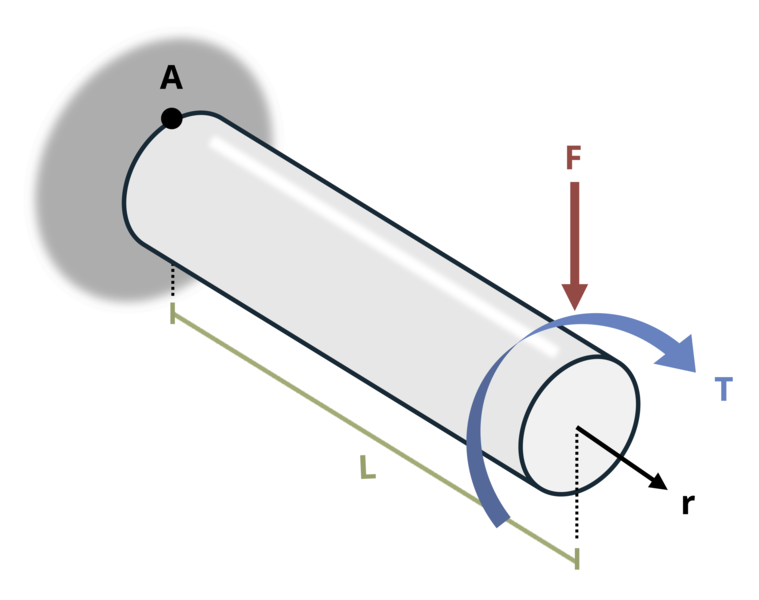

# Problem 14.10 - General Combined Loads {.unnumbered}

## Problem Statement

A solid circular rod of length L = 2 ft and radius r = 2 in. is subjected to load F = 0.5 kips and torsional moment T = 12 kip-in. Determine the maximum principal stress at point A.

{fig-alt="A cantilevered solid circular rod is subjected to a point load F and a torsional force of F. The rod has a radius of r and a length of L."}
\[Problem adapted from © Kurt Gramoll CC BY NC-SA 4.0\]
