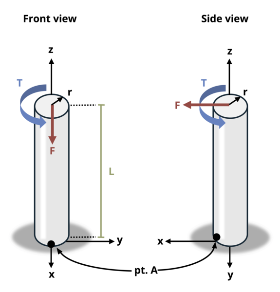

# Problem 14.11 - General Combined Loads {.unnumbered}

## Problem Statement

A solid circular rod of length L = 1.2 m and radius r = 50 mm is subjected to load F = 1 kN and torsional moment T = 0.5 kN-m. Determine the absolute maximum normal stress at point A.

{fig-alt="A cantilevered solid circular rod is subjected to a point load F and a torsional force of F. The rod has a radius of r and a length of L.."}
\[Problem adapted from © Kurt Gramoll CC BY NC-SA 4.0\]
