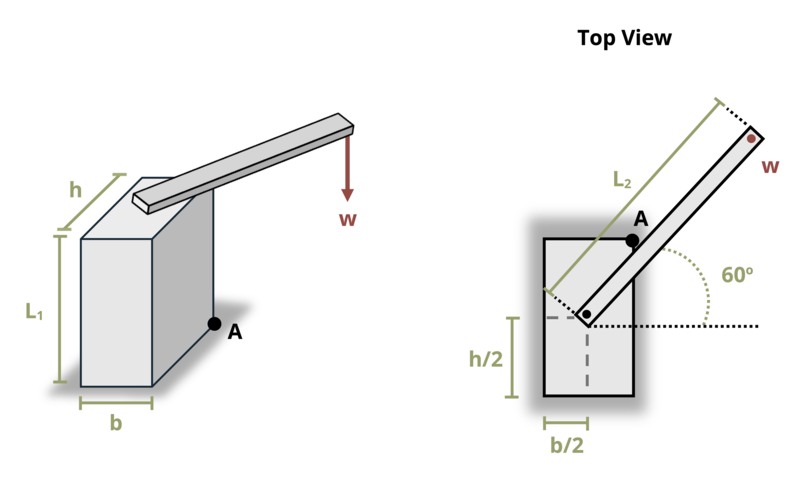

# Problem 14.1 - Eccentric Axial Loads {.unnumbered}

## Problem Statement

A large column supports a cantilevered load W = 8 kips as shown. Dimensions b = 2 ft, h = 4 ft, L1 = 10 ft, and L2 = 10 ft. What is the magnitude of the compressive stress at point A? Assume the cantilevered beam does not fail or bend.

{fig-alt="A large column supports a cantilevered load of w. The column has a height of L1, a width of h, and a thickness of b. The cantilevered beam has a length of L2 and is at 60 degrees above he horizontal."}
\[Problem adapted from © Kurt Gramoll CC BY NC-SA 4.0\]
