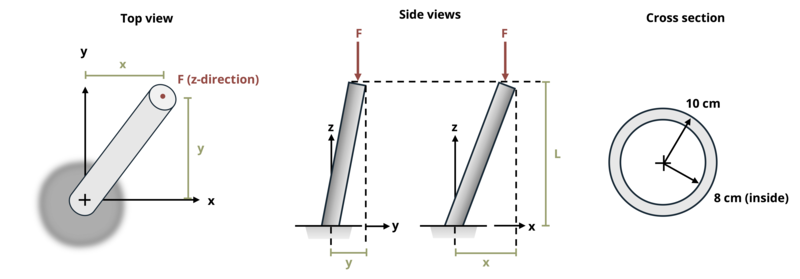

# Problem 14.2 - Eccentric Axial Loads {.unnumbered}

## Problem Statement

A metal electric pole supporting a load F = 50 kN was knocked at an angle during a recent storm. If dimensions x = 2000 mm, y = 1000 mm, and L = 8 m, determine the magnitude of the maximum normal stress at the base.

{fig-alt="A metal pole with a load of F leans at an angle. The metal pole has an x dimention of x, a y dimension of y, and a z dimension of 8m. The force F is applied in the negative z direction. The metal pole has a circular ring cross section with an outer radius of 10cm and an inner radius of 8cm."}
\[Problem adapted from © Kurt Gramoll CC BY NC-SA 4.0\]
