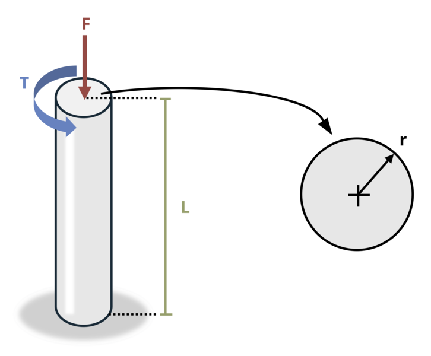

# Problem 14.9 - General Combined Loads {.unnumbered}

## Problem Statement

A solid circular rod of length L = 6 m and radius r = 35 mm is subjected to axial load F = 17.5 kN and torsional moment T = 17.5 kN-m. Determine the absolute maximum shear stress (for any coordinate direction) at any location in the bar.

{fig-alt="A solid circular rod with a radius of r is subjected to an axial load F and a torsional moment T. The rod is length L."}
\[Problem adapted from © Kurt Gramoll CC BY NC-SA 4.0\]
