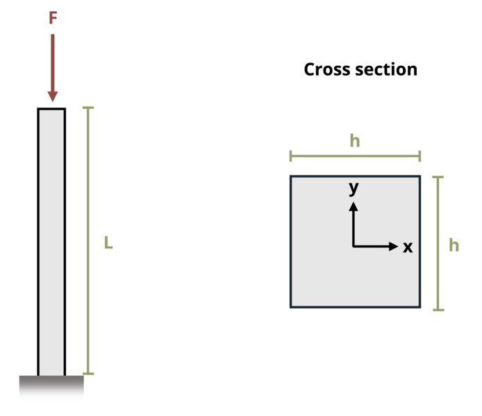

# Problem 15.11 - Effect of Supports {.unnumbered}

## Problem Statement

A column with a square cross-section is used to support a force F = 5 kips. The column is fixed at its base and free at the other end. If length L = 18 ft and elastic modulus E = 29,000 ksi, determine the minimum dimension, h, so that the column will not buckle.

{fig-alt="A column of length L has a square cross section hxh and is subjected to force F."}
\[Problem adapted from © Kurt Gramoll CC BY NC-SA 4.0\]
