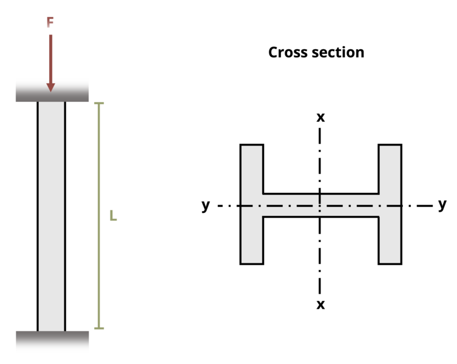

# Problem 15.12 - Effect of Supports {.unnumbered}

## Problem Statement

A W16 x 40 beam is used as a column with a length L = 20 ft. It is fixed at both ends and subjected to load F = 300 kips. If the elastic modulus E = 29,000 ksi, determine the factor of safety with respect to buckling.

{fig-alt="A W10x45 with a length of L is subjected to a force F. The W10x45 is fixed at both ends."}
\[Problem adapted from © Kurt Gramoll CC BY NC-SA 4.0\]
