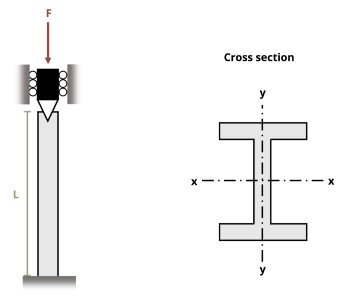

# Problem 15.13 - Effect of Supports {.unnumbered}

## Problem Statement

A W8 x 15 beam (Ix = 48.0 in.4, Iy = 3.41 in.4) is used as a column with one end fixed and the other end pinned. If the length of the column L = 25 ft, determine the largest load it can carry with a factor of safety of 2. The elastic modulus E = 10,000 ksi.

{fig-alt="A wide flange W8x15 of length L is subjected to force F. The column is fixed at the lower end and pinned on the top end in the x and y directions."}
\[Problem adapted from © Kurt Gramoll CC BY NC-SA 4.0\]
