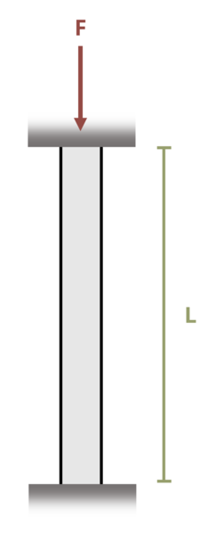

# Problem 15.14 - Effect of Supports {.unnumbered}

## Problem Statement

A wide-flange column that is fixed at both ends is required to carry a load F = 500 kips. If length L = 30 ft and the elastic modulus E = 29,000 ksi, determine the lightest structural member in Appendix A that can be used. Use a factor of safety of 2 against buckling.

{fig-alt="A column of length L is fixed at both ends and is subjected to a force F."}
\[Problem adapted from © Kurt Gramoll CC BY NC-SA 4.0\]
