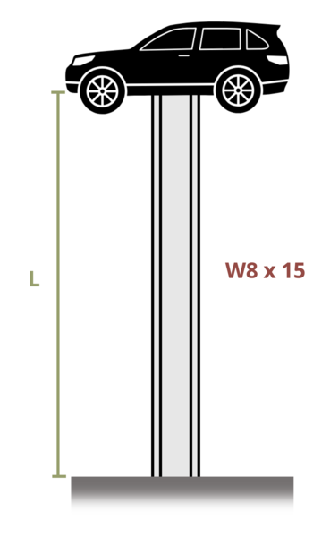

# Problem 15.15 - Effect of Supports {.unnumbered}

## Problem Statement

To draw attention, a junkyard owner mounts a car on top of a column of length L = 30 ft made from a W8 x 15 beam (Ix = 48.0 in.4, Iy = 3.41 in.4). If the elastic modulus E = 29,000 ksi, what is the heaviest car body that can be used to avoid buckling? Use a factor of safety of 2.25.

{fig-alt="A car is placed on top of a W8x15 beam of length L."}
\[Problem adapted from © Kurt Gramoll CC BY NC-SA 4.0\]
