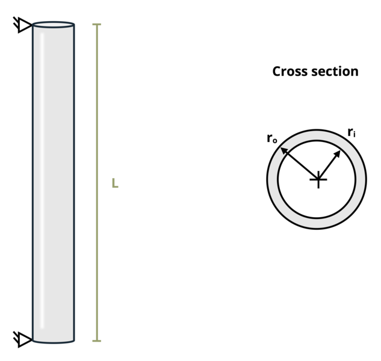

# Problem 15.1 - Buckling & Yield - Euler's Formula {.unnumbered}

## Problem Statement

A steel (E = 200 GPa) tube column with a yield strength of 250 MPa is pinned at both ends. If length L = 6 m, outer radius ro = 75 mm and inner radius ri = 70 mm, determine the maximum allowable load the column can support.

{fig-alt="A long steel tube of length L has an outer radius of ro and an inner radius of ri."}
\[Problem adapted from © Kurt Gramoll CC BY NC-SA 4.0\]
