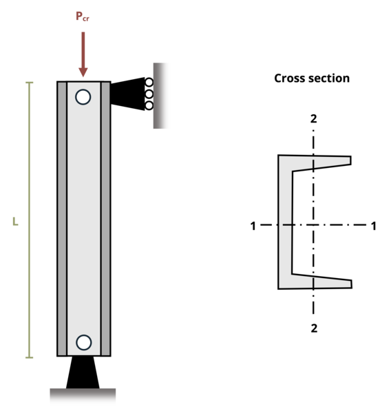

# Problem 15.2 - Buckling & Yield - Euler's Formula {.unnumbered}

## Problem Statement

A W14 x 34 beam is used as a column that is pinned at both ends. If length L = 30 ft and the elastic modulus E = 280 x 106 psi, determine the critical stress for the column.

{fig-alt="A C 12x30 channel beam has a length of L and is subjected to a force Pcr."}
\[Problem adapted from © Kurt Gramoll CC BY NC-SA 4.0\]
