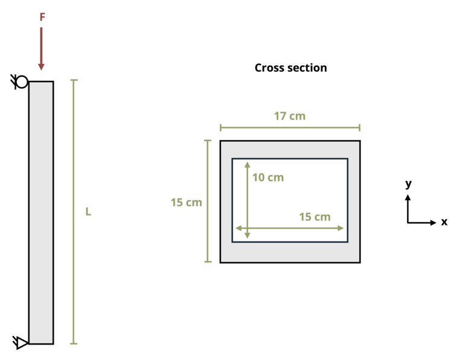

# Problem 15.3 - Buckling & Yield - Euler's Formula {.unnumbered}

## Problem Statement

A column is pinned at both ends and supports a load F = 500 kN. Determine the maximum allowable column length, L. Use a factor of safety of 2 and assume the elastic modulus E = 200 GPa.

{fig-alt="A column of length L with pins at both ends is subjected to a force F. The column is a hollow rectangle with an exterior width of 17 cm and an exterior height of 15 cm and an interior width of 15cm and an interior height of 10 cm."}
\[Problem adapted from © Kurt Gramoll CC BY NC-SA 4.0\]
