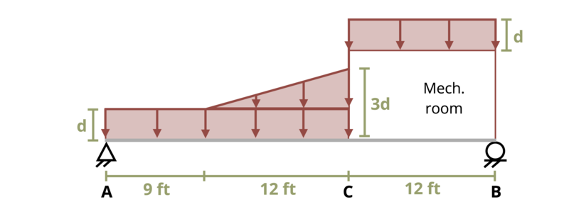

# Problem 1.3 - Equilibrium in 2D {.unnumbered}

{fig-alt="Picture with a simply supported beam being subjected to a loading. The beam is pinned at the left side and has a roller at the right end. The beam is of length 33 ft. There is a uniform distributed load over the first 21 ft of the beam of depth d and weight w. There is a triangular distributed load from 12 ft to 21 ft from the left end of the beam of height 2d and weight w. There is also a uniform distributed load from 21 ft to 33 ft from the left end of depth d and weight w."}
\[Problem adapted from © Chris Galitz CC BY NC-SA 4.0\]
```{shinylive-python}
#| standalone: true
#| viewerHeight: 600
#| components: [viewer]

from shiny import App, render, ui, reactive
import random
import asyncio
import io
import math
import string
from datetime import datetime
from pathlib import Path

def generate_random_letters(length):
    # Generate a random string of letters of specified length
    return "".join(random.choice(string.ascii_lowercase) for _ in range(length))

problem_ID = "643"
d = reactive.Value("__")
w = reactive.Value("__")
attempts = ["Timestamp,Attempt,Answer1,Answer2,Feedback\n"]

app_ui = ui.page_fluid(
    #ui.markdown("**Please enter your ID number from your instructor and click to generate your problem**"),
    #ui.input_text("ID", "", placeholder="Enter ID Number Here"),
    #ui.input_action_button("generate_problem", "Generate Problem", class_="btn-primary"),
    ui.markdown("**Problem Statement**"),
    ui.output_ui("ui_problem_statement"),
    ui.input_text("answer1", "Your Answer 1 in units of kip", placeholder="Please enter your answer 1"),
    ui.input_text("answer2", "Your Answer 2 in units of kip", placeholder="Please enter your answer 2"),
    ui.input_action_button("submit", "Check Answers", class_="btn-primary"),
    #ui.download_button("download", "Download File to Submit", class_="btn-success"),
)

def server(input, output, session):
    # Initialize a counter for attempts
    attempt_counter = reactive.Value(0)

    @output
    @render.ui
    def ui_problem_statement():
        randomize_vars()
        return [
            ui.markdown(
                f"The simply-supported roof beam AB is subjected to snow loads as a uniform load with snow depth d = {d()} in. A mechanical room on the roof is also covered by snow, and transmits half of the the snow load between points B and C to the roof at point B and the other half at point C. Additionally, there is a snow drift as shown with maximum height, 3*d, above the roof. If the distributed weight of snow is W = {w()} lb/ft per inch of thickness, determine the reactions at supports A and B."
            )
        ]

    #@reactive.Effect
    #@reactive.event(input.generate_problem)
    def randomize_vars():
        random.seed(101)
        d.set(random.randrange(10,30,1))
        w.set(random.randrange(40,80,1))
        
    @reactive.Effect
    @reactive.event(input.submit)
    def _():
        attempt_counter.set(
            attempt_counter() + 1
        )  # Increment the attempt counter on each submission.

        # Calculate the instructor's answer and determine if the user's answer is correct.
        w1 = w()*12*d()
        w2 = w()*21*d()
        w3 = 0.5*w()*2*d()*12
        instr1 = (w1+w2+w3-(10.5*w2+17*w3+21*w1/2+33*w1/2)/33)/1000
        instr2 = ((10.5*w2+17*w3+21*w1/2+33*w1/2)/33)/1000

        correct1 = math.isclose(float(input.answer1()), instr1, rel_tol=0.01)
        correct2 = math.isclose(float(input.answer2()), instr2, rel_tol=0.01)
        
        if correct1 and correct2:
            check = f"{'both correct.'}"
        elif correct1:
            check = f" {'correct for answer 1 and incorrect for answer 2.'}"
        elif correct2:
            check = f"{'incorrect for answer 1 and correct for answer 2.'}"
        else:
            check = f"{'both incorrect.'}"
        
        correct_indicator = "JL" if correct1 and correct2 else "JG"

        random_start = generate_random_letters(4)
        random_middle = generate_random_letters(4)
        random_end = generate_random_letters(4)
        #encoded_attempt = f"{random_start}{problem_ID}-{random_middle}{attempt_counter()}{correct_indicator}-{random_end}{input.ID()}"

        #session.encoded_attempt = reactive.Value(encoded_attempt)
        attempts.append(f"{datetime.now()}, {attempt_counter()}, {input.answer1()}, {input.answer2()}, {check}\n")

        feedback = ui.markdown(f"Your answers of {input.answer1()} and {input.answer2()} are {check}.")
        m = ui.modal(feedback, title="Feedback", easy_close=True)
        ui.modal_show(m)

    #@render.download(filename=lambda: f"Problem_Log-{problem_ID}-{input.ID()}.csv")
    async def download():
        final_encoded = session.encoded_attempt() if session.encoded_attempt is not None else "No attempts"
        yield f"{final_encoded}\n\n"
        yield "Timestamp,Attempt,Answer1,Answer2,Feedback\n"
        for attempt in attempts[1:]:
            await asyncio.sleep(0.25)
            yield attempt

app = App(app_ui, server)
```
