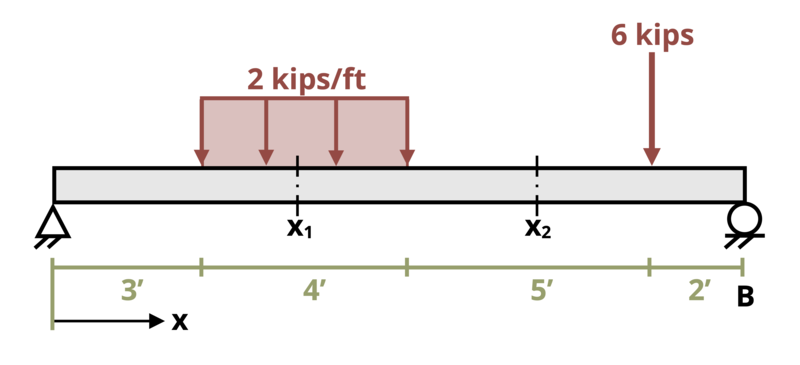

# Problem 1.4 - Internal Reactions {.unnumbered}

{fig-alt="Picture with a simply supported beam subjected to a loading. The beam is of legth 14 ft with a pin at the left end and a roller at the right end. A uniform distributed load, w, is applied downwards from 3 ft to 7 ft from the left end. A point load, P, is applied downwards a distance of 12 ft from the left end."}
\[Problem adapted from © Chris Galitz CC BY NC-SA 4.0\]
```{shinylive-python}
#| standalone: true
#| viewerHeight: 600
#| components: [viewer]

from shiny import App, render, ui, reactive
import random
import asyncio
import io
import math
import string
from datetime import datetime
from pathlib import Path

def generate_random_letters(length):
    # Generate a random string of letters of specified length
    return "".join(random.choice(string.ascii_lowercase) for _ in range(length))

problem_ID = "644"
x1 = reactive.Value("__")
x2 = reactive.Value("__")
P = reactive.Value("__")
w = reactive.Value("__")
attempts = ["Timestamp,Attempt,Answer1,Answer2,Answer3,Answer4,Answer5,Answer6,Feedback\n"]

app_ui = ui.page_fluid(
    ui.markdown("**Please enter your ID number from your instructor and click to generate your problem**"),
    ui.input_text("ID", "", placeholder="Enter ID Number Here"),
    ui.input_action_button("generate_problem", "Generate Problem", class_="btn-primary"),
    ui.markdown("**Problem Statement**"),
    ui.output_ui("ui_problem_statement"),
    ui.input_text("answer1", "Your Answer 1 in units of kip", placeholder="Please enter your answer 1"),
    ui.input_text("answer2", "Your Answer 2 in units of kip", placeholder="Please enter your answer 2"),
    ui.input_text("answer3", "Your Answer 3 in units of kip-ft", placeholder="Please enter your answer 2"),
    ui.input_text("answer4", "Your Answer 4 in units of kip", placeholder="Please enter your answer 2"),
    ui.input_text("answer5", "Your Answer 5 in units of kip", placeholder="Please enter your answer 2"),
    ui.input_text("answer6", "Your Answer 6 in units of kip-ft", placeholder="Please enter your answer 2"),

    ui.input_action_button("submit", "Submit Answers", class_="btn-primary"),
    ui.download_button("download", "Download File to Submit", class_="btn-success"),
)

def server(input, output, session):
    # Initialize a counter for attempts
    attempt_counter = reactive.Value(0)

    @output
    @render.ui
    def ui_problem_statement():
        return [
            ui.markdown(
                f"The simply-supported beam is subjected to the loading shown. Determine the internal normal force, N, shear force, V, and bending moment, M, at locations x<sub>1</sub> = {x1()} ft and x<sub>2</sub> = {x2()} ft. Assume loads P = {P()} kips and w = {w()} kips/ft. Use appropriate signs in your answers."
            )
        ]

    @reactive.Effect
    @reactive.event(input.generate_problem)
    def randomize_vars():
        random.seed(input.ID()+100)
        x1.set(random.randrange(41,69,1)/10)
        x2.set(random.randrange(75,115,1)/10)
        P.set(random.randrange(5,25,1))
        w.set(random.randrange(20,50,1)/10)
        
    @reactive.Effect
    @reactive.event(input.submit)
    def _():
        attempt_counter.set(
            attempt_counter() + 1
        )  # Increment the attempt counter on each submission.

        # Calculate the instructor's answer and determine if the user's answer is correct.
        instr1 = 0
        Ay = (P()*2+w()*4*9)/14
        instr2 = Ay-w()*(x1()-3)
        instr3 = w()*(x1()-3)*(3+(x1()-3)/2)+instr2*x1()
        instr4=0
        instr5= Ay-w()*4
        instr6= w()*4*5-instr5*x2()

        correct1 = math.isclose(float(input.answer1()), instr1, rel_tol=0.01)
        correct2 = math.isclose(float(input.answer2()), instr2, rel_tol=0.01)
        correct3 = math.isclose(float(input.answer3()), instr3, rel_tol=0.01)
        correct4 = math.isclose(float(input.answer3()), instr4, rel_tol=0.01)
        correct5 = math.isclose(float(input.answer3()), instr5, rel_tol=0.01)
        correct6 = math.isclose(float(input.answer3()), instr6, rel_tol=0.01)

        if correct1 and correct2 and correct3 and correct4 and correct5 and correct6:
            check = "All answers are correct."
        else:
            conditions = []
            for i, correct in enumerate([correct1, correct2, correct3, correct4, correct5, correct6], start=1):
                if correct:
                    conditions.append(f"correct for answer {i}")
                else:
                    conditions.append(f"incorrect for answer {i}")
            check = "; ".join(conditions) + "."
        
        correct_indicator = "JL" if correct1 and correct2 and correct3 and correct4 and correct5 and correct6 else "JG"

        random_start = generate_random_letters(4)
        random_middle = generate_random_letters(4)
        random_end = generate_random_letters(4)
        encoded_attempt = f"{random_start}{problem_ID}-{random_middle}{attempt_counter()}{correct_indicator}-{random_end}{input.ID()}"

        session.encoded_attempt = reactive.Value(encoded_attempt)
        attempts.append(f"{datetime.now()}, {attempt_counter()}, {input.answer1()}, {input.answer2()}, {check}\n")

        feedback = ui.markdown(f"Your answers of {input.answer1()}, {input.answer2()}, {input.answer3()}, {input.answer4()}, {input.answer5()}, and {input.answer6()}  are {check}.")
        m = ui.modal(feedback, title="Feedback", easy_close=True)
        ui.modal_show(m)

    @session.download(filename=lambda: f"Problem_Log-{problem_ID}-{input.ID()}.csv")
    async def download():
        final_encoded = session.encoded_attempt() if session.encoded_attempt is not None else "No attempts"
        yield f"{final_encoded}\n\n"
        yield "Timestamp,Attempt,Answer1,Answer2,Feedback\n"
        for attempt in attempts[1:]:
            await asyncio.sleep(0.25)
            yield attempt

app = App(app_ui, server)
```
